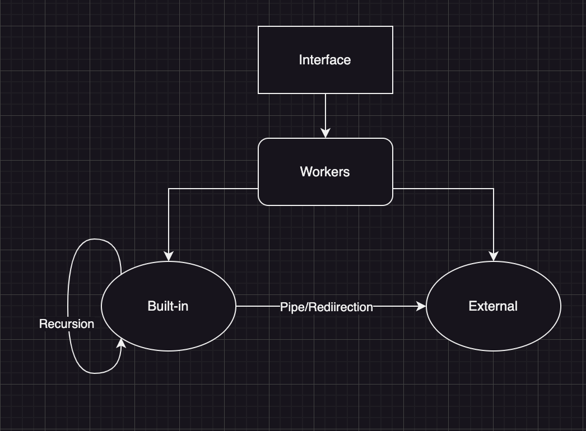

### What is this?
This is a basic yet functional C program, intended to function as a Unix shell. It provides a range of commands that closely resemble those commonly encountered in Unix systems. Notably, this shell possesses the ability to handle concurrent pipe operations and execute IO redirections. Below is the high-level design overview of the program:

### How to use?
1. Make sure your computer is able to compile c code.
2. Run `make` in the directory of the project.
3. Run `./main` to start the program.